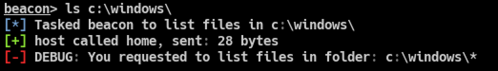
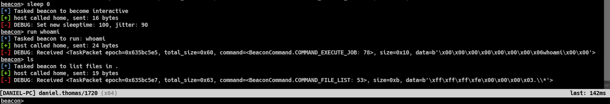

=======================
A Minimal Beacon Client
=======================

This tutorial shows how to implement your own minimal beacon client that can handle tasks from the Cobalt Strike
Team Server and send back custom responses (also known as callbacks).

While the CLI tool :doc:`beacon-client <../tools/beacon-client>` is already a fully working client that can connect to a
Team Server given a beacon payload, it does not have any task handlers.
While this is very useful for testing and monitoring, it might be useful to have a client that can handle tasks and
send custom callback responses back to the Team Server.

We can make our own custom beacon client by using the ``dissect.cobaltstrike.client`` module.

.. note::

    Currently only the HTTP and HTTPS protocol is supported, so DNS beacons are not yet supported.

See also :doc:`scripts/example_client.py <../scripts/example_client>` for a more detailed implemented client.

Installation
------------

First we install ``dissect.cobaltstrike`` with the ``[c2]`` extra, as we are going to communicate with C2 Servers:

.. code-block:: bash

    $ pip install dissect.cobaltstrike[c2]

This installs the necessary dependencies such as `PyCryptodome` and `httpx`.

Basic client
------------

The are two ways of implementing a Beacon client, first is to subclass ``HttpBeaconClient`` and second one is to instantiate
a ``HttpBeaconClient`` and use `decorators` to register task handlers on this instance. We will use the decorator method in
the following steps but also show how to implement it using a subclass at the end of this tutorial.

Here is a basic client that can do check-ins but has no task handlers:

.. code-block:: python
    :caption: myclient.py

    from dissect.cobaltstrike.client import HttpBeaconClient, parse_commandline_options

    client = HttpBeaconClient()

    args, options = parse_commandline_options()
    client.run(**options)

Let's break down what the current script is doing:

.. code-block:: python
    :caption: myclient01.py
    :emphasize-lines: 1

    from dissect.cobaltstrike.client import HttpBeaconClient, parse_commandline_options

    client = HttpBeaconClient()

    args, options = parse_commandline_options()
    client.run(**options)

We first import :class:`~dissect.cobaltstrike.client.HttpBeaconClient` and :meth:`~dissect.cobaltstrike.client.parse_commandline_options`.

.. code-block:: python
    :caption: myclient02.py
    :emphasize-lines: 3

    from dissect.cobaltstrike.client import HttpBeaconClient, parse_commandline_options

    client = HttpBeaconClient()

    args, options = parse_commandline_options()
    client.run(**options)

We instantiate a :class:`~dissect.cobaltstrike.client.HttpBeaconClient` and store this in the (global) variable ``client``.

.. code-block:: python
    :caption: myclient03.py
    :emphasize-lines: 5

    from dissect.cobaltstrike.client import HttpBeaconClient, parse_commandline_options

    client = HttpBeaconClient()

    args, options = parse_commandline_options()
    client.run(**options)

We now call :meth:`~dissect.cobaltstrike.client.parse_commandline_options` which uses a builtin ``ArgumentParser`` with common beacon client options
and return this as ``args`` and a dictionary ``options`` which can be passed to our ``run()`` method.

.. code-block:: python
    :caption: myclient03.py
    :emphasize-lines: 6

    from dissect.cobaltstrike.client import HttpBeaconClient, parse_commandline_options

    client = HttpBeaconClient()

    args, options = parse_commandline_options()
    client.run(**options)

We then run the client with our options, the double ``**options`` expands the ``options`` as keyword arguments so you
don't have to manually pass keyword options arguments to ``run()`` like this:

.. code-block:: python

    client.run(bconfig=options["bconfig"], beacon_id=options["beacon_id"], ...)

When ``client.run()`` is executed it will start the beacon loop to actively connect to the Cobalt Strike Team Server and retrieve tasks.
However, there are no task handlers yet and basically this acts the same as the :doc:`beacon-client <../tools/beacon-client>` CLI tool.

Let's implement a task handler in the next section!

Task handler
^^^^^^^^^^^^

We are going to implement a Task handler when the ``ls`` command is issued from the Team Server to our Beacon client:

.. code-block:: python
    :caption: myclient_ls_01.py
    :emphasize-lines: 2

    from dissect.cobaltstrike.client import HttpBeaconClient, parse_commandline_options
    from dissect.cobaltstrike.client import BeaconCommand, TaskPacket

    client = HttpBeaconClient()

    @client.handle(BeaconCommand.COMMAND_FILE_LIST)
    def handle_file_list(task: TaskPacket):
        print(f"Received: {task}!")

    args, options = parse_commandline_options()
    client.run(**options)

We import :class:`~dissect.cobaltstrike.c_c2.BeaconCommand` and :class:`~dissect.cobaltstrike.c_c2.TaskPacket` here to
make things easier when using an IDE such as VSCode for autocompletion.

.. code-block:: python
    :caption: myclient_ls_02.py
    :emphasize-lines: 7,8

    from dissect.cobaltstrike.client import HttpBeaconClient, parse_commandline_options
    from dissect.cobaltstrike.client import BeaconCommand, TaskPacket

    client = HttpBeaconClient()

    @client.handle(BeaconCommand.COMMAND_FILE_LIST)
    def handle_file_list(task: TaskPacket):
        print(f"Received: {task}!")

    args, options = parse_commandline_options()
    client.run(**options)

We define our task handler function called ``handle_file_list`` with a single argument ``task``.
The handler function must accept a single argument which is a :class:`~dissect.cobaltstrike.c_c2.TaskPacket` object and
is a simple wrapper around a ``dissect.cstruct`` instance with the following structure:

.. literalinclude:: ../../dissect/cobaltstrike/c_c2.py
        :start-at: typedef struct TaskPacket
        :end-at: };
        :language: c

In this handler we just print the received task.

.. code-block:: python
    :caption: myclient_ls_03.py
    :emphasize-lines: 6

    from dissect.cobaltstrike.client import HttpBeaconClient, parse_commandline_options
    from dissect.cobaltstrike.client import BeaconCommand, TaskPacket

    client = HttpBeaconClient()

    @client.handle(BeaconCommand.COMMAND_FILE_LIST)
    def handle_file_list(task: TaskPacket):
        print(f"Received task: {task}!")

    args, options = parse_commandline_options()
    client.run(**options)

Next we decorate this function with ``@client.handle()`` passing in the ``COMMAND_FILE_LIST`` command id.
This registers the method as a handler for when a ``COMMAND_FILE_LIST`` command is Tasked by the Team Server.
For a complete list of `COMMANDS` you can refer to :class:`~dissect.cobaltstrike.c_c2.BeaconCommand`.

When we now run the client and receive a ``ls`` Task we will see:

.. code-block:: bash

    $ python myclient_ls_03.py beacon.bin -v
    ...
    Received task: <TaskPacket epoch=0x635bba6a, total_size=0x24, command=<BeaconCommand.COMMAND_FILE_LIST: 53>, size=0xb, data=b'\xff\xff\xff\xfe\x00\x00\x00\x03.\\*'>

.. .. code-block:: python

..     from dissect.cobaltstrike.client import HttpBeaconClient, BeaconCommand, TaskPacket
..     from dissect.cobaltstrike.client import parse_commandline_options
..     from dissect.cobaltstrike.client import CallbackDebugMessage

..     client = HttpBeaconClient()

..     @client.handle(BeaconCommand.COMMAND_FILE_LIST)
..     def handle_file_list(task: TaskPacket):
..         return CallbackDebugMessage("hello world")

..     args, options = parse_commandline_options()
..     client.run(**options)

.. To break down the script, we first import the classes and functions that we use.
.. Then we create a new :class:`~dissect.cobaltstrike.client.HttpBeaconClient` instance called ``client``.

.. Next we define the function ``handle_file_list`` that will be called when a ``COMMAND_FILE_LIST`` command is
.. tasked by the Team Server. For a complete list of `COMMANDS` you can refer to :class:`~dissect.cobaltstrike.c_c2.BeaconCommand`.

Parsing Task data
^^^^^^^^^^^^^^^^^

The ``task.data`` attribute contains the raw Task data bytes, and must still be parsed if you want to do anything with it.
Currently you need to parse this manually as there are many different Tasks and they all have a different structure.

Here is an example on how to parse the ``task.data`` for a ``COMMAND_FILE_LIST`` TaskPacket:

.. code-block:: python
    :caption: myclient_parse_ls_01.py
    :emphasize-lines: 1,4

    from io import BytesIO
    from dissect.cobaltstrike.client import HttpBeaconClient, parse_commandline_options
    from dissect.cobaltstrike.client import BeaconCommand, TaskPacket
    from dissect.cobaltstrike.utils import u32be

    client = HttpBeaconClient()

    @client.handle(BeaconCommand.COMMAND_FILE_LIST)
    def handle_file_list(task: TaskPacket):
        # Parse task data for file listing, which is structured as:
        #
        # |<request_number>|<size_of_folder>|<folder>|
        with BytesIO(task.data) as data:
            req_no = u32be(data.read(4))
            size = u32be(data.read(4))
            folder = data.read(size).decode()

        print(f"Received ls for {folder}!")

    args, options = parse_commandline_options()
    client.run(**options)

We first need some extra imports so we can easier parse data, ``BytesIO`` for reading bytes as a file-like object
and ``u32be`` to read bytes as an uint32 value in Big Endian.

.. code-block:: python
    :caption: myclient_parse_ls_02.py
    :emphasize-lines: 13,14,14,15,16

    from io import BytesIO
    from dissect.cobaltstrike.client import HttpBeaconClient, parse_commandline_options
    from dissect.cobaltstrike.client import BeaconCommand, TaskPacket
    from dissect.cobaltstrike.utils import u32be

    client = HttpBeaconClient()

    @client.handle(BeaconCommand.COMMAND_FILE_LIST)
    def handle_file_list(task: TaskPacket):
        # Parse task data for file listing, which is structured as:
        #
        # |<request_number>|<size_of_folder>|<folder>|
        with BytesIO(task.data) as data:
            req_no = u32be(data.read(4))
            size = u32be(data.read(4))
            folder = data.read(size).decode()

        print(f"Received ls for {folder}!")

    args, options = parse_commandline_options()
    client.run(**options)

We create a ``BytesIO`` instance from the ``task.data`` bytes so it acts more a like file-like object.
And then we read the first uint32 value as the `request_number`, second uint32 is the size of the `folder` name buffer that is being requested.
And finally we read the `folder` name using that size.

We finally print the parsed folder name that is being requested for ``ls``.

Sending Callbacks
^^^^^^^^^^^^^^^^^

Instead of printing stuff locally, let's make it more interesting by sending back some data to the Team Server. Also known as a `Callback`.

.. code-block:: python
    :caption: myclient_ls_callback_01.py
    :emphasize-lines: 4

    from io import BytesIO
    from dissect.cobaltstrike.client import HttpBeaconClient, parse_commandline_options
    from dissect.cobaltstrike.client import BeaconCommand, TaskPacket
    from dissect.cobaltstrike.client import CallbackDebugMessage
    from dissect.cobaltstrike.utils import u32be

    client = HttpBeaconClient()

    @client.handle(BeaconCommand.COMMAND_FILE_LIST)
    def handle_file_list(task: TaskPacket):
        # Parse task data for file listing, which is structured as:
        #
        # |<request_number>|<size_of_folder>|<folder>|
        with BytesIO(task.data) as data:
            req_no = u32be(data.read(4))
            size = u32be(data.read(4))
            folder = data.read(size).decode()

        # Return a debug message that prints which folder was requested for `ls`.
        return CallbackDebugMessage(f"You requested to list files in folder: {folder}")

    args, options = parse_commandline_options()
    client.run(**options)

We first import a new helper function called :meth:`~dissect.cobaltstrike.client.CallbackDebugMessage` which we can use to create a debug message that is
printed on the Team Server console.

.. code-block:: python
    :caption: myclient_ls_callback_02.py
    :emphasize-lines: 20

    from io import BytesIO
    from dissect.cobaltstrike.client import HttpBeaconClient, parse_commandline_options
    from dissect.cobaltstrike.client import BeaconCommand, TaskPacket
    from dissect.cobaltstrike.client import CallbackDebugMessage
    from dissect.cobaltstrike.utils import u32be

    client = HttpBeaconClient()

    @client.handle(BeaconCommand.COMMAND_FILE_LIST)
    def handle_file_list(task: TaskPacket):
        # Parse task data for file listing, which is structured as:
        #
        # |<request_number>|<size_of_folder>|<folder>|
        with BytesIO(task.data) as data:
            req_no = u32be(data.read(4))
            size = u32be(data.read(4))
            folder = data.read(size).decode()

        # Return a debug message that prints which folder was requested for `ls`.
        return CallbackDebugMessage(f"You requested to list files in folder: {folder}")

    args, options = parse_commandline_options()
    client.run(**options)

Here we return a :meth:`~dissect.cobaltstrike.client.CallbackDebugMessage` with our custom string, which the
Team Server will receive and output as a debug message.

    Debug message shown on the Team Server console

Ofcourse this is not your standard response to a ``ls`` command, you can
see :doc:`scripts/example_client.py <../scripts/example_client>` that does implement a proper ``ls`` response.

Subclassed client
-----------------

Instead of using the ``@client.handle`` decorator to register task handlers you can also
subclass :class:`~dissect.cobaltstrike.client.HttpBeaconClient` and adding your own handlers
by defining a ``on_<command>`` method within your class:

.. code-block:: python
    :caption: echo_client.py

    from io import BytesIO

    from dissect.cobaltstrike.client import HttpBeaconClient, parse_commandline_options
    from dissect.cobaltstrike.client import TaskPacket
    from dissect.cobaltstrike.client import CallbackDebugMessage
    from dissect.cobaltstrike.utils import u32be

    class EchoClient(HttpBeaconClient):
        def on_sleep(self, task: TaskPacket):
            with BytesIO(task.data) as data:
                self.sleeptime = u32be(data.read(4))
                self.jitter = u32be(data.read(4))

            return CallbackDebugMessage(
                f"Set new sleeptime: {self.sleeptime}, jitter: {self.jitter}"
            )

        def on_catch_all(self, task: TaskPacket):
            if task is None:
                return

            return CallbackDebugMessage(f"Received {task}")

    if __name__ == "__main__":
        client = EchoClient()
        args, options = parse_commandline_options()
        client.run(**options)

When the command ``COMMAND_SLEEP`` is tasked it will call ``on_sleep`` and we modify the internal sleep timers on the client.

The ``on_catch_all`` is a special handler that will be called when no handlers are registered for the given Task, acting
as a `catch_all` function. This is the same as the ``@client.catch_all`` decorator.

When we run the ``echo_client.py`` we see our issued Tasks being echoed back on the Team Server console:

.. code-block:: bash

    $ python3 echo_client.py beacon.bin -v

    Echo beacon client echoing all TaskPackets back to the Team Server console

Next steps
----------

This concludes the tutorial that showed how to implement a beacon client using a decorator and a subclass.
It also showed how to parse Task data and send back Callback data to the Team Server.

You can take a look at :doc:`scripts/example_client.py <../scripts/example_client>` for a more detailed implemented client.